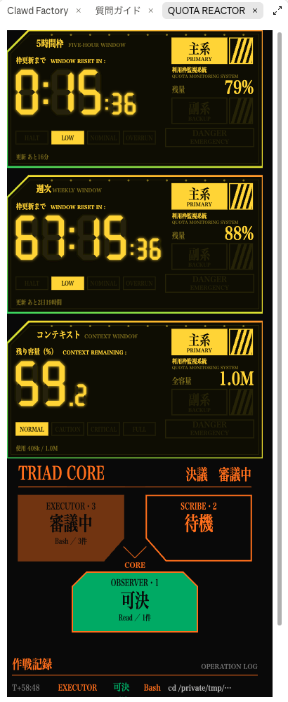

# quota-reactor

A Claude Code plugin that turns the side pane into a retro sci-fi reactor console. Your rate-limit windows and context window become seven-segment timers, every tool call is voted on by a three-unit board, and a warning band lights up above the prompt.



## What it shows

**Timers (top of the pane)**

- One timer per rate-limit window that Claude Code reports: the 5-hour window and the weekly window.
- When fewer than three windows are reported, the next slot shows the remaining context window.
- Each timer counts down to the moment it matters:
  - `OVERRUN`: at the current pace the window runs out before it resets, so the timer counts down to the projected limit (`稼働限界まで / OPERATING LIMIT IN`).
  - `NOMINAL` / `LOW`: the window lasts until it resets, so the timer counts down to the reset (`枠更新まで / WINDOW RESET IN`). `LOW` means usage is under half of the elapsed share of the window.
  - `HALT`: the window is used up. The display blinks `0:00`.
- Colors follow the remaining share: yellow above 50%, amber from 20% to 50% (or when `OVERRUN`), red below 20%. `DANGER EMERGENCY` blinks when the projected limit is under 30 minutes away or usage passes 90%.
- The context timer shows the remaining percentage and its stage: `NORMAL` below 60% used, `CAUTION` up to 80%, `CRITICAL` up to 95%, `FULL` above.

**TRIAD CORE and the operation log**

- Every tool call is deliberated by one of three units: `OBSERVER` (Read, Grep, Glob, web fetches), `SCRIBE` (Edit, Write, NotebookEdit), `EXECUTOR` (Bash and everything else).
- A unit shows `審議中` (running) while its call runs, then `可決` (succeeded) or `否決` (errored or denied).
- The operation log lists each call with its elapsed time, unit, verdict, tool, and target.

**Warning band (above the prompt)**

- Red while a Bash command runs, with the command shown.
- Red with a `確認` (dismiss) button after a tool call fails.
- Red when any rate-limit window passes 90% usage.
- Amber while Claude is working.

## Install

```
/plugin marketplace add jnk0vc/quota-reactor
/plugin install quota-reactor@quota-reactor
```

The pane opens on its own when the window is wide enough. Run `/reactor` to open it at any time.

## Requirements

- A Claude Code build with function-hook plugins (early access). Tested on Claude Code 2.1.286.
- Some builds ship function hooks turned off (2.1.281 does). If the pane never appears after installing, start Claude Code with the flag set:

  ```
  CLAUDE_CODE_ENABLE_FUNCTION_HOOKS=1 claude
  ```
- The desktop Code tab draws the full console with SVG. The terminal shows the same information as colored text.
- Rate-limit timers need a Claude subscription. Without one, only the context timer appears.

## Notes

- The second ticks inside the SVG itself, so the pane is redrawn only when the usage figures change or every 10 minutes to resync.
- The layout adapts to the pane width: three timers side by side on wide panes, compact stacked strips on medium panes, full-size stacked timers on narrow panes.
- The panel text uses the system's condensed Mincho typeface (Hiragino Mincho, Yu Mincho, or Noto Serif JP). No fonts are bundled.
- This is an original design and is not affiliated with or endorsed by any film, anime, or game.

## 日本語

Claude Codeのサイドパネルに、レトロSF風の計器盤を出すプラグインです。

- 上段のタイマーは、5時間枠と週次の利用枠を7セグメント表示で数え下ろします。報告される利用枠が3つに満たないときは、空いた基にコンテキストの残量を出します。
- 今のペースだとリセット前に使い切る見込みの枠は`OVERRUN`になり、使い切るまでの残り時間を表示します。リセットまで持つ枠は、リセットまでの残り時間を表示します。
- 色は残量で変わります。50%超は黄、20〜50%は橙、20%未満は赤です。
- 下段のTRIAD COREでは、ツール実行を3基（OBSERVER・SCRIBE・EXECUTOR）が審議し、結果を作戦記録に残します。
- 入力欄の上の警告帯は、Bashの実行中、ツールの失敗時、利用枠の使用率が90%を超えたときに赤く点灯します。

インストールは上の「Install」のコマンドで行います。パネルは`/reactor`でいつでも開けます。

このプラグインはClaude Codeの早期アクセス機能（関数フックのプラグイン）を使います。2.1.281など、この機能が既定でオフになっている版では、インストールしてもパネルが出ません。その場合は`CLAUDE_CODE_ENABLE_FUNCTION_HOOKS=1 claude`のように環境変数を付けて起動してください。

## License

[MIT](LICENSE)
